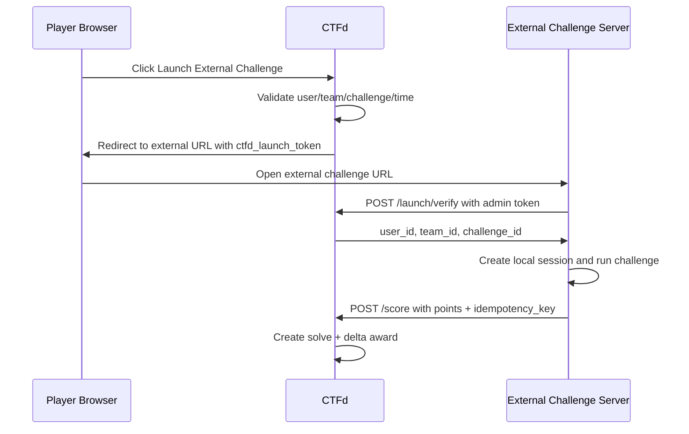

# CTFd External Challenge Scoring

A CTFd plugin for **externally-scored, variable-point challenges in teams mode**.

Use this when a challenge is graded outside CTFd, for example:

- ML/data-science challenges,
- optimization challenges,
- simulation challenges,
- fuzzing challenges,
- any challenge where a team should receive a variable integer score.

The plugin adds a new CTFd challenge type:

```text
external_scored
```

Players launch the external challenge from CTFd. The external challenge server verifies a short-lived CTFd launch token, evaluates the player/team, then reports a score back to CTFd.

---

## Table of contents

- [Quick start](#quick-start)
- [External server quickstart](#external-server-quickstart)
- [Screenshots](#screenshots)
- [How the scoring works](#how-the-scoring-works)
- [API reference](#api-reference)
- [Security notes](#security-notes)
- [Troubleshooting](#troubleshooting)
- [Design details](#design-details)
- [Development and testing](#development-and-testing)

---

## Quick start

This section is the shortest path to getting the plugin working.

### 1. Install the plugin

From the root of your CTFd repository:

```bash
cd /path/to/CTFd
git clone git@github.com:caprinux/ctfd-external-challenge-scoring.git CTFd/plugins/external_scoring
```

The directory name must be exactly:

```text
CTFd/plugins/external_scoring
```

CTFd imports the plugin as:

```python
CTFd.plugins.external_scoring
```

### 2. Restart CTFd

For a source-based install, restart your CTFd process.

For Docker Compose:

```bash
docker compose restart ctfd
```

If your deployment bakes plugins into the image, rebuild first:

```bash
docker compose build ctfd
docker compose up -d
```

### 3. Confirm the plugin loaded

CTFd logs should contain:

```text
Loaded module, <module 'CTFd.plugins.external_scoring' ...>
```

The plugin creates these database tables:

```text
external_scoring_launches
external_scores
external_score_events
```

### 4. Make sure CTFd is in teams mode

This plugin is designed for CTFd **teams mode**.

In CTFd setup/admin configuration, use:

```text
user_mode = teams
```

### 5. Create an External Scored challenge

In the CTFd admin UI:

1. Go to **Admin → Challenges → Create Challenge**.
2. Select **external_scored**.
3. Set normal challenge fields:
   - name,
   - category,
   - description.
4. Set **External Challenge URL**, for example:

```text
https://ml-challenge.example.com/start
```

5. Save/publish the challenge.

The challenge value is forced to `0`. This is intentional. Variable points are awarded by plugin-created CTFd awards.

The external URL must be an absolute `http://` or `https://` URL.

### 6. Create a CTFd admin API token

The external challenge server needs a CTFd admin token to:

1. verify launch tokens,
2. submit scores.

Recommended:

- create a dedicated admin/service account,
- generate an access token for that account,
- store the token only on the external challenge server.

Do **not** expose the admin token to the browser.

### 7. Implement the external server

The external challenge server must do two things:

1. receive `ctfd_launch_token` from CTFd and verify it,
2. submit scores to CTFd with an `idempotency_key`.

See [External server quickstart](#external-server-quickstart) for copy-paste examples.

---

## External server quickstart

### Flow overview



### Step 1: Receive the launch token

When a player clicks the CTFd launch link, CTFd redirects them to your external URL with a query parameter:

```text
https://ml-challenge.example.com/start?ctfd_launch_token=<token>
```

Your external server should immediately verify this token with CTFd.

### Step 2: Verify the launch token

```python
import requests

CTFD_URL = "https://ctfd.example.com"
ADMIN_TOKEN = "<ctfd-admin-token>"


def verify_launch_token(token):
    response = requests.post(
        f"{CTFD_URL}/api/v1/external-scoring/launch/verify",
        headers={"Authorization": f"Bearer {ADMIN_TOKEN}"},
        json={"token": token},
        timeout=10,
    )
    response.raise_for_status()
    return response.json()["data"]
```

A successful response contains:

```json
{
  "user_id": 12,
  "team_id": 3,
  "challenge_id": 5,
  "user_name": "alice",
  "team_name": "blue-team"
}
```

The launch token is:

- valid for 5 minutes,
- single-use,
- consumed when verified.

After verification, your external server should create its own local session for the player.

### Step 3: Submit a score

```python
from uuid import uuid4
import requests

CTFD_URL = "https://ctfd.example.com"
ADMIN_TOKEN = "<ctfd-admin-token>"


def submit_score(challenge_id, user_id, team_id, points, summary=None, details=None):
    response = requests.post(
        f"{CTFD_URL}/api/v1/external-scoring/challenges/{challenge_id}/score",
        headers={"Authorization": f"Bearer {ADMIN_TOKEN}"},
        json={
            "user_id": user_id,
            "team_id": team_id,
            "points": points,
            "idempotency_key": str(uuid4()),
            "provided": summary,
            "details": details or {},
        },
        timeout=10,
    )
    response.raise_for_status()
    return response.json()["data"]
```

`points` must be a non-negative integer.

The plugin uses **best-only** scoring. If a team already has 85 points and submits 72 points, the submission is recorded but no additional score is awarded.

### Minimal Flask external server example

This is a small example external challenge server. It verifies the CTFd launch token, stores the CTFd identity in a local Flask session, and submits a score.

```python
import os
from uuid import uuid4

import requests
from flask import Flask, redirect, request, session

app = Flask(__name__)
app.secret_key = os.environ["SESSION_SECRET"]

CTFD_URL = os.environ["CTFD_URL"]
ADMIN_TOKEN = os.environ["CTFD_ADMIN_TOKEN"]


@app.route("/start")
def start():
    token = request.args["ctfd_launch_token"]

    response = requests.post(
        f"{CTFD_URL}/api/v1/external-scoring/launch/verify",
        headers={"Authorization": f"Bearer {ADMIN_TOKEN}"},
        json={"token": token},
        timeout=10,
    )
    response.raise_for_status()

    data = response.json()["data"]
    session["user_id"] = data["user_id"]
    session["team_id"] = data["team_id"]
    session["challenge_id"] = data["challenge_id"]

    return redirect("/challenge")


@app.route("/challenge")
def challenge():
    if "user_id" not in session:
        return "Launch this challenge from CTFd first", 403

    return """
        <h1>External challenge</h1>
        <form method="post" action="/submit">
            <label>Demo score</label>
            <input type="number" name="points" min="0" max="2147483647" required>
            <button type="submit">Submit score</button>
        </form>
    """


@app.route("/submit", methods=["POST"])
def submit():
    if "user_id" not in session:
        return "Launch this challenge from CTFd first", 403

    points = int(request.form["points"])

    response = requests.post(
        f"{CTFD_URL}/api/v1/external-scoring/challenges/{session['challenge_id']}/score",
        headers={"Authorization": f"Bearer {ADMIN_TOKEN}"},
        json={
            "user_id": session["user_id"],
            "team_id": session["team_id"],
            "points": points,
            "idempotency_key": str(uuid4()),
            "provided": f"Demo score submission: {points}",
            "details": {"source": "minimal-flask-example"},
        },
        timeout=10,
    )
    response.raise_for_status()

    data = response.json()["data"]
    best = data["score"]["best_points"]
    awarded = data["event"]["delta_awarded"]

    return f"Submitted {points}. Team best is now {best}. Awarded +{awarded}."
```

Example environment:

```bash
export SESSION_SECRET='change-me'
export CTFD_URL='https://ctfd.example.com'
export CTFD_ADMIN_TOKEN='<ctfd-admin-token>'
flask run -h 0.0.0.0 -p 5000
```

Then configure the CTFd challenge's external URL as:

```text
https://ml-challenge.example.com/start
```

---

## Screenshots

### Admin: create an external scored challenge

The plugin adds an `external_scored` challenge type. The challenge value is forced to `0`, and admins configure the external challenge URL that CTFd will redirect players to.


### Admin: update an external scored challenge

The update form keeps the challenge value fixed at `0` and exposes the external challenge URL as the key plugin-specific field.


### Player: challenge board

The challenge card still shows the global CTFd value, which is `0` for this challenge type. Team-specific best score is shown inside the challenge popup/window.


### Player: launch link, best score, and score history

Inside the challenge popup/window, players see their team's current best score, a launch link, and all past team submissions including whether each submission awarded additional points.


---

## How the scoring works

CTFd stores normal challenge points on the challenge itself:

```text
Challenges.value
```

A solve records that a user/team solved the challenge, but CTFd solve rows do not have a per-team or per-user point value.

This plugin therefore uses:

1. CTFd `Solves` to mark the challenge solved.
2. CTFd `Awards` to grant variable points.

External scored challenges have base value `0`. The team receives points through awards created by the plugin.

### Best-only scoring

The scoring policy is:

```text
team score for challenge = max(all submitted scores for that team/challenge)
```

Because CTFd awards are additive, the plugin awards only improvements over the previous best.

Example:

| Submitted score | Previous best | Award delta | Team best after submission |
| --- | ---: | ---: | ---: |
| 0 | 0 | +0 | 0 |
| 40 | 0 | +40 | 40 |
| 85 | 40 | +45 | 85 |
| 72 | 85 | +0 | 85 |

### Zero-point solves

A `0` point submission still creates a CTFd solve. This means:

- the challenge appears solved,
- solve count increases,
- unlocks/prerequisites depending on the solve work normally,
- no score is awarded unless the team later improves above 0.

---

## API reference

### 1. Launch an external challenge

Browser route used by players:

```http
GET /external-scoring/launch/<challenge_id>
```

Authentication:

- normal CTFd user session required.

Checks:

- CTFd is in teams mode,
- user is on a team,
- challenge exists,
- challenge type is `external_scored`,
- challenge is visible/unlocked,
- CTF is active,
- CTF is not paused,
- freeze time has not passed,
- if CTFd email verification is enabled, user email is verified.

Success response:

```http
302 Found
Location: <external_url>?ctfd_launch_token=<token>
```

---

### 2. Verify launch token

Called by the external challenge server:

```http
POST /api/v1/external-scoring/launch/verify
Authorization: Bearer <admin-token>
Content-Type: application/json
```

Request:

```json
{
  "token": "..."
}
```

Success:

```json
{
  "success": true,
  "data": {
    "user_id": 12,
    "team_id": 3,
    "challenge_id": 5,
    "user_name": "alice",
    "team_name": "blue-team"
  }
}
```

Example:

```bash
curl -sS \
  -X POST 'https://ctfd.example.com/api/v1/external-scoring/launch/verify' \
  -H 'Authorization: Bearer <ctfd-admin-token>' \
  -H 'Content-Type: application/json' \
  -d '{"token":"<ctfd_launch_token>"}'
```

---

### 3. Submit score

Called by the external challenge server:

```http
POST /api/v1/external-scoring/challenges/<challenge_id>/score
Authorization: Bearer <admin-token>
Content-Type: application/json
```

Request:

```json
{
  "user_id": 12,
  "team_id": 3,
  "points": 85,
  "idempotency_key": "run-9f8f2b2e-1b5a-4db4-a5f1-9bb7e9",
  "provided": "accuracy=0.850",
  "details": {
    "accuracy": 0.85,
    "model_hash": "optional"
  }
}
```

Fields:

| Field | Required | Description |
| --- | --- | --- |
| `user_id` | yes | CTFd user who caused the submission. |
| `team_id` | yes | Team receiving the score. The plugin verifies the user is on this team. |
| `points` | yes | Non-negative integer score, maximum `2147483647`. |
| `idempotency_key` | yes | Unique external attempt/run ID. Prevents duplicate processing. Max 128 chars. |
| `provided` | no | Human-readable submission/result summary. Max 4096 characters. |
| `details` | no | JSON metadata for the score event. Max encoded size 65535 bytes. |

Success:

```json
{
  "success": true,
  "data": {
    "idempotent_replay": false,
    "score": {
      "challenge_id": 5,
      "team_id": 3,
      "best_points": 85,
      "best_user_id": 12,
      "solve_id": 99
    },
    "event": {
      "id": 123,
      "challenge_id": 5,
      "team_id": 3,
      "user_id": 12,
      "user_name": "alice",
      "points": 85,
      "previous_best": 40,
      "new_best": 85,
      "delta_awarded": 45,
      "award_id": 77,
      "solve_id": 99,
      "idempotency_key": "run-9f8f2b2e-1b5a-4db4-a5f1-9bb7e9",
      "provided": "accuracy=0.850",
      "details": {
        "accuracy": 0.85
      },
      "created": "2026-05-09T11:08:00Z"
    }
  }
}
```

Duplicate idempotency key:

```json
{
  "success": true,
  "data": {
    "idempotent_replay": true,
    "score": { "...": "..." },
    "event": { "...": "..." }
  }
}
```

Example:

```bash
curl -sS \
  -X POST 'https://ctfd.example.com/api/v1/external-scoring/challenges/5/score' \
  -H 'Authorization: Bearer <ctfd-admin-token>' \
  -H 'Content-Type: application/json' \
  -d '{
    "user_id": 12,
    "team_id": 3,
    "points": 85,
    "idempotency_key": "run-9f8f2b2e-1b5a-4db4-a5f1-9bb7e9",
    "provided": "accuracy=0.850",
    "details": {"accuracy": 0.85}
  }'
```

---

### 4. Get current team's score history

User-facing API:

```http
GET /api/v1/external-scoring/challenges/<challenge_id>/score/me
```

Authentication:

- normal CTFd user session required.

This endpoint returns only the current user's team history for that challenge.

Success:

```json
{
  "success": true,
  "data": {
    "score": {
      "challenge_id": 5,
      "team_id": 3,
      "best_points": 85,
      "best_user_id": 12,
      "solve_id": 99
    },
    "events": [
      {
        "id": 123,
        "points": 85,
        "previous_best": 40,
        "new_best": 85,
        "delta_awarded": 45
      }
    ]
  }
}
```

---

## Idempotency keys

`idempotency_key` is required for every score submission.

It is a unique ID generated by the external challenge server for one scoring attempt. It prevents duplicate scoring if the external server retries after a timeout or network failure.

Good choices:

- UUIDv4 per scoring attempt,
- database primary key for the external submission,
- job/run ID from the external scorer.

Do not reuse an idempotency key for different attempts.

---

## Security notes

### External server does not need CTFd cookies

The external challenge server should not consume CTFd's Flask session cookie. Instead, CTFd issues a short-lived launch token and the external server verifies it through CTFd.

This limits exposure of CTFd session cookies to challenge infrastructure.

### Admin token handling

The external server uses a CTFd admin token.

Recommendations:

- store it only server-side,
- never send it to browsers,
- use HTTPS,
- use a dedicated admin/service account,
- rotate the token periodically,
- restrict network access where possible.

### Input limits

The plugin enforces:

- external URLs must be absolute `http(s)` URLs,
- scores must be non-negative integers,
- scores must be at most `2147483647`,
- idempotency keys must be at most 128 characters,
- `provided` text must be at most 4096 characters,
- `details` JSON must encode to at most 65535 bytes.

---

## Troubleshooting

### Plugin does not appear in challenge types

Check:

- directory is exactly `CTFd/plugins/external_scoring`,
- directory contains `__init__.py`,
- CTFd was restarted,
- CTFd is not running in safe mode,
- CTFd logs show the plugin loaded.

### API token appears ignored

CTFd's Bearer-token auth is processed for JSON API requests. Make sure requests include:

```http
Content-Type: application/json
Authorization: Bearer <token>
```

### Score submission succeeds but scoreboard does not update

The plugin clears CTFd standings and challenge caches after score submissions. If using multiple CTFd workers, ensure all workers share the configured cache backend.

### Lower score creates no points

Expected. The plugin is best-only. Lower/equal submissions are recorded but award no additional points.

### Duplicate score returns `idempotent_replay: true`

Expected. The same `idempotency_key` was already processed.

### Launch token verification fails after refresh

Expected if the token was already verified. Launch tokens are single-use. The external server should create its own local session after successful verification.

---

## Design details

For deeper rationale, see [`DESIGN.md`](DESIGN.md).

### Database tables

The plugin creates:

```text
external_scoring_launches
external_scores
external_score_events
```

`external_scoring_launches` stores single-use launch tokens.

`external_scores` stores one current-best row per team/challenge.

`external_score_events` stores every submitted score event.

### CTFd objects created

On score submission, the plugin may create:

- one `Solves` row per team/challenge,
- zero or more `Awards` rows for positive score improvements,
- one `external_score_events` row per unique idempotency key.

---

## Development and testing

This plugin was developed against CTFd `3.8.4` and tested with CTFd's Docker Compose stack.

Useful commands from a CTFd repository root:

```bash
docker compose build ctfd
docker compose up -d db cache permissions ctfd
docker compose logs -f ctfd
```

Inspect plugin tables in the default Docker Compose MariaDB service:

```bash
docker compose exec db mariadb -uctfd -pctfd ctfd -e "SHOW TABLES LIKE 'external%';"
```

Static scan used during development:

```bash
bandit -r __init__.py models.py migrations
```
