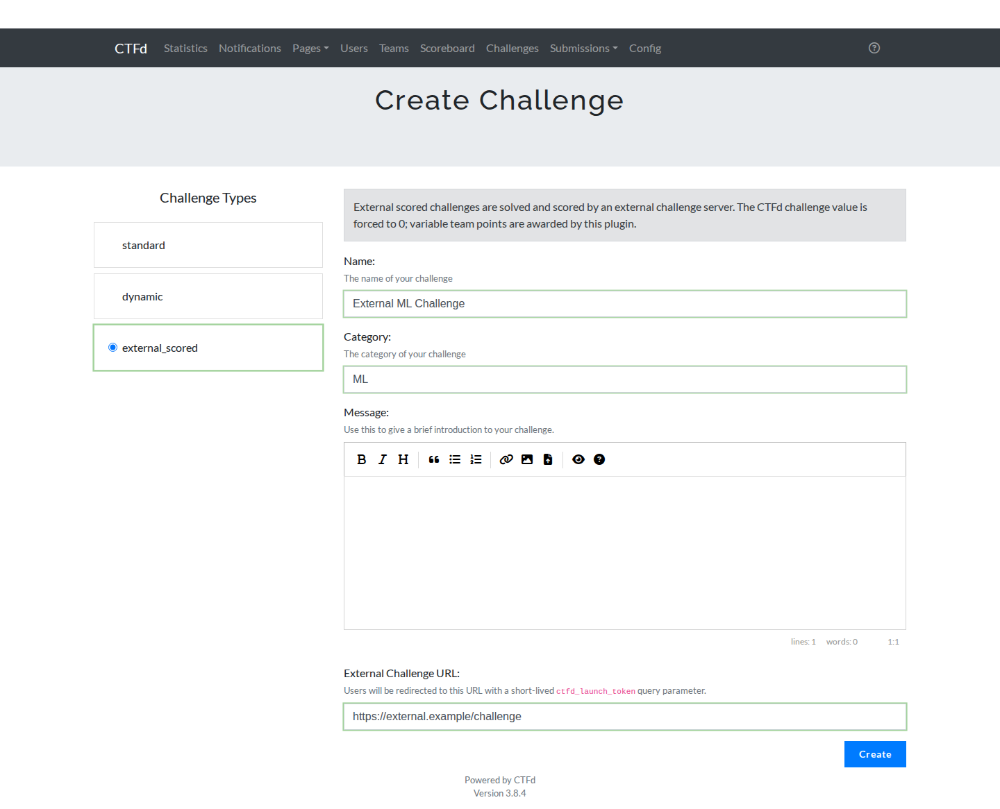
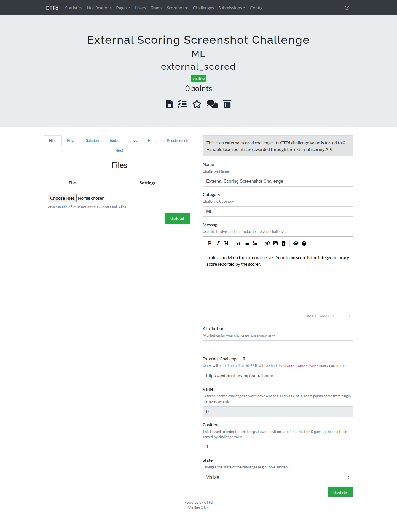
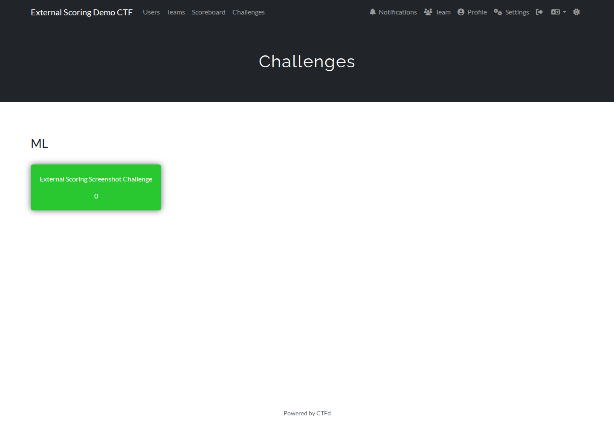
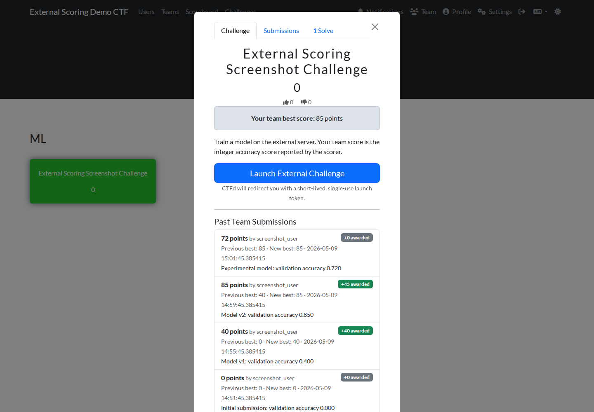

# CTFd External Challenge Scoring

A CTFd plugin that adds externally-scored, variable-point challenges for **CTFd teams mode**.

This plugin is intended for challenges where the answer is evaluated by an external service rather than by CTFd's normal flag checker. Typical examples include ML/data-science challenges, optimization challenges, fuzzing challenges, long-running simulations, or any challenge where participants can receive a variable integer score.

The plugin adds a new CTFd challenge type named:

```text
external_scored
```

External challenge servers launch users via a short-lived CTFd launch token and report scores back to CTFd through an admin-authenticated API.

---

## Status

Implemented and smoke-tested against the cloned CTFd source tree reporting CTFd version `3.8.4`.

Tested behavior includes:

- plugin loading under Docker Compose,
- plugin database migration creation,
- external challenge creation,
- launch-token redirect generation,
- launch-token verification,
- single-use launch-token enforcement,
- `0` point solves,
- higher-score delta awards,
- lower/equal score submissions with no new points,
- required idempotency keys,
- idempotency replay handling,
- team score history API,
- challenge modal rendering.

---

## Screenshots

### Admin: create an external scored challenge

The plugin adds an `external_scored` challenge type. The challenge value is forced to `0`, and admins configure the external challenge URL that CTFd will redirect players to.



### Admin: update an external scored challenge

The update form keeps the challenge value fixed at `0` and exposes the external challenge URL as the key plugin-specific field.



### Player: challenge board

The challenge card still shows the global CTFd value, which is `0` for this challenge type. Team-specific best score is shown inside the challenge popup/window.



### Player: launch link, best score, and score history

Inside the challenge popup/window, players see their team's current best score, a launch link, and all past team submissions including whether each submission awarded additional points.



---

## Why this plugin exists

CTFd's normal scoring model stores challenge points on the challenge itself:

```text
Challenges.value
```

A solve records that a user/team solved the challenge, but the solve row itself does not have a per-team or per-user point value. This means CTFd does not natively support one team earning 40 points for a challenge while another earns 55 points for the same challenge.

This plugin implements variable challenge scores by combining two built-in CTFd concepts:

1. `Solves` mark the external challenge as solved.
2. `Awards` grant the variable team points.

External scored challenges have a base CTFd value of `0`. The team score comes from plugin-created award deltas.

Example:

| Submitted score | Previous best | Award delta | Team best after submission |
| --- | ---: | ---: | ---: |
| 0 | 0 | +0 | 0 |
| 40 | 0 | +40 | 40 |
| 55 | 40 | +15 | 55 |
| 50 | 55 | +0 | 55 |

The scoreboard therefore reflects each team's best score for the external challenge while still using CTFd's native scoring machinery.

---

## Features

- New challenge type: `External Scored` / `external_scored`.
- Teams-mode scoring.
- Challenge base value forced to `0`.
- Normal flag input hidden from players.
- Launch link shown in the challenge window.
- Short-lived launch tokens.
- Single-use launch tokens.
- External server launch verification API.
- External server score submission API.
- Required score idempotency keys.
- Best-only scoring policy.
- Score improvements are awarded as deltas.
- `0` point scores still mark the challenge solved.
- All score submissions are recorded.
- Team members can see their team's score history.
- CTF time, pause, and freeze checks for launch and scoring.
- Plugin-owned migrations.

---

## Limitations / v1 behavior

- Only supports **teams mode**.
- Scores must be non-negative integers.
- The main challenge board card still shows `0`, because CTFd challenge cards display the global challenge value. The personalized team best score is shown inside the challenge popup/window.
- There is no dedicated admin UI yet for viewing/revoking external scores.
- The score submission API currently uses a normal CTFd admin token. Treat that token as highly sensitive.
- The plugin does not make external challenge servers consume CTFd session cookies. It uses a safer launch-token flow instead.

---

## Repository layout

This repository is itself the CTFd plugin directory. The important files are:

```text
.
├── __init__.py
├── models.py
├── DESIGN.md
├── README.md
├── docs/
│   └── screenshots/
├── assets/
│   ├── create.html
│   ├── create.js
│   ├── update.html
│   ├── update.js
│   ├── view.html
│   └── view.js
└── migrations/
    └── 9f7b8a6c5d4e_create_external_scoring_tables.py
```

When installed into CTFd, the directory name must be:

```text
external_scoring
```

so CTFd can import it as:

```python
CTFd.plugins.external_scoring
```

---

## Installation

### Install into a CTFd source checkout

From the root of your CTFd repository:

```bash
git clone git@github.com:caprinux/ctfd-external-challenge-scoring.git CTFd/plugins/external_scoring
```

Then restart CTFd.

CTFd loads plugins at startup. On startup, this plugin registers the challenge type and runs its migrations.

### Install into a Docker Compose CTFd deployment

If your CTFd deployment bind-mounts the CTFd source tree, clone the plugin into the CTFd plugins directory:

```bash
cd /path/to/CTFd
git clone git@github.com:caprinux/ctfd-external-challenge-scoring.git CTFd/plugins/external_scoring
docker compose restart ctfd
```

If your deployment builds a CTFd image, rebuild and restart:

```bash
cd /path/to/CTFd
git clone git@github.com:caprinux/ctfd-external-challenge-scoring.git CTFd/plugins/external_scoring
docker compose build ctfd
docker compose up -d
```

### Confirm plugin load

CTFd logs should contain something like:

```text
Loaded module, <module 'CTFd.plugins.external_scoring' ...>
```

For a SQL database, the plugin should create:

```text
external_scoring_launches
external_scores
external_score_events
```

---

## CTFd configuration assumptions

This plugin expects:

1. CTFd is configured in **teams mode**.
2. Users are members of teams before launching/scoring external challenges.
3. External challenge servers have a CTFd admin API token.
4. External challenge URLs are configured per challenge.

---

## Creating an external scored challenge

In the CTFd admin panel:

1. Go to challenge creation.
2. Select `External Scored`.
3. Fill in:
   - name,
   - category,
   - description,
   - external challenge URL.
4. Save/publish the challenge.

The challenge value is forced to `0`. This is intentional.

The external challenge URL is stored in CTFd's `connection_info` field and is used as the launch redirect target.

---

## Player flow

1. Player opens the CTFd challenge.
2. The challenge popup/window displays:
   - base value `0`,
   - current team best score,
   - score submission history,
   - a `Launch External Challenge` link.
3. Player clicks the launch link.
4. CTFd checks eligibility and creates a short-lived, single-use launch token.
5. CTFd redirects the player to the external server:

```text
https://external.example/challenge?ctfd_launch_token=<token>
```

6. The external server verifies the token with CTFd.
7. The external server creates its own local user session.
8. The player interacts with the external challenge.
9. The external server submits score events back to CTFd.

---

## External server integration

External challenge servers should implement two pieces of logic:

1. Verify CTFd launch tokens.
2. Submit score events.

The external server should **not** depend on the launch token after verification. Launch tokens are single-use. After verification, the external server should create its own local session/cookie for the participant.

---

## API reference

All plugin APIs are JSON APIs unless otherwise stated.

### 1. Launch a challenge

User-facing browser route:

```http
GET /external-scoring/launch/<challenge_id>
```

Authentication:

- normal CTFd user session required.

Checks:

- CTFd is in teams mode,
- user is on a team,
- challenge exists,
- challenge type is `external_scored`,
- challenge is visible/unlocked,
- CTF is active,
- CTF is not paused,
- freeze time has not passed.

Success response:

```http
302 Found
Location: <external_url>?ctfd_launch_token=<token>
```

The token expires after 5 minutes and is single-use.

---

### 2. Verify a launch token

External server endpoint:

```http
POST /api/v1/external-scoring/launch/verify
Authorization: Bearer <admin-token>
Content-Type: application/json
```

Request body:

```json
{
  "token": "..."
}
```

Success response:

```json
{
  "success": true,
  "data": {
    "user_id": 12,
    "team_id": 3,
    "challenge_id": 5,
    "user_name": "alice",
    "team_name": "blue-team"
  }
}
```

Failure examples:

- token missing,
- token invalid,
- token expired,
- token already used,
- user/team no longer exists,
- user is no longer on the team,
- CTF is paused/outside time/frozen.

Example `curl`:

```bash
curl -sS \
  -X POST 'https://ctfd.example.com/api/v1/external-scoring/launch/verify' \
  -H 'Authorization: Bearer ctfd_xxx' \
  -H 'Content-Type: application/json' \
  -d '{"token":"PASTE_TOKEN_HERE"}'
```

---

### 3. Submit a score

External server endpoint:

```http
POST /api/v1/external-scoring/challenges/<challenge_id>/score
Authorization: Bearer <admin-token>
Content-Type: application/json
```

Request body:

```json
{
  "user_id": 12,
  "team_id": 3,
  "points": 55,
  "idempotency_key": "run-9f8f2b2e-1b5a-4db4-a5f1-9bb7e9",
  "provided": "accuracy=0.9123",
  "details": {
    "accuracy": 0.9123,
    "model_hash": "optional"
  }
}
```

Fields:

| Field | Required | Description |
| --- | --- | --- |
| `user_id` | yes | CTFd user who caused the submission. |
| `team_id` | yes | Team receiving the score. The plugin verifies the user is on this team. |
| `points` | yes | Non-negative integer score. |
| `idempotency_key` | yes | Unique external attempt/run ID. Prevents duplicate processing. Max 128 chars. |
| `provided` | no | Human-readable submission/result summary. |
| `details` | no | JSON metadata for the score event. |

Success response:

```json
{
  "success": true,
  "data": {
    "idempotent_replay": false,
    "score": {
      "challenge_id": 5,
      "team_id": 3,
      "best_points": 55,
      "best_user_id": 12,
      "solve_id": 99
    },
    "event": {
      "id": 123,
      "challenge_id": 5,
      "team_id": 3,
      "user_id": 12,
      "user_name": "alice",
      "points": 55,
      "previous_best": 40,
      "new_best": 55,
      "delta_awarded": 15,
      "award_id": 77,
      "solve_id": 99,
      "idempotency_key": "run-9f8f2b2e-1b5a-4db4-a5f1-9bb7e9",
      "provided": "accuracy=0.9123",
      "details": {
        "accuracy": 0.9123
      },
      "created": "2026-05-09T11:08:00Z"
    }
  }
}
```

If the same idempotency key is submitted again, the plugin returns the already-processed event:

```json
{
  "success": true,
  "data": {
    "idempotent_replay": true,
    "score": { "...": "..." },
    "event": { "...": "..." }
  }
}
```

Example `curl`:

```bash
curl -sS \
  -X POST 'https://ctfd.example.com/api/v1/external-scoring/challenges/5/score' \
  -H 'Authorization: Bearer ctfd_xxx' \
  -H 'Content-Type: application/json' \
  -d '{
    "user_id": 12,
    "team_id": 3,
    "points": 55,
    "idempotency_key": "run-9f8f2b2e-1b5a-4db4-a5f1-9bb7e9",
    "provided": "accuracy=0.9123",
    "details": {"accuracy": 0.9123}
  }'
```

---

### 4. Get current team's score/history

User-facing API:

```http
GET /api/v1/external-scoring/challenges/<challenge_id>/score/me
```

Authentication:

- normal CTFd user session required.

Response:

```json
{
  "success": true,
  "data": {
    "score": {
      "challenge_id": 5,
      "team_id": 3,
      "best_points": 55,
      "best_user_id": 12,
      "solve_id": 99
    },
    "events": [
      {
        "id": 123,
        "points": 55,
        "previous_best": 40,
        "new_best": 55,
        "delta_awarded": 15
      }
    ]
  }
}
```

The challenge view also renders this information server-side in the challenge popup/window.

---

## Idempotency keys

`idempotency_key` is required for score submissions.

An idempotency key is a unique ID generated by the external challenge server for one scoring attempt. It protects against duplicate scoring if the external server retries a request after a timeout or network failure.

Recommended values:

- UUIDv4 per submission,
- database primary key for the external submission,
- run/job ID from the external scoring system.

Do not reuse an idempotency key for different attempts.

---

## Scoring details

### Solves

The plugin creates a CTFd `Solves` row once per team/challenge. This happens even when the submitted score is `0`.

This means:

- CTFd marks the challenge as solved,
- solve count increases,
- prerequisites/solution visibility work like normal solves.

### Awards

The plugin creates CTFd `Awards` only for positive improvements over the team's previous best.

A lower or equal score creates a score event but no award.

### Best-only policy

The current scoring policy is best-only:

```text
team score for challenge = max(all submitted points for that team/challenge)
```

Because CTFd awards are additive, the plugin implements this by awarding only score deltas.

---

## Database schema

The plugin creates three tables.

### `external_scoring_launches`

Stores single-use launch tokens.

Important columns:

- `jti`
- `user_id`
- `team_id`
- `challenge_id`
- `created`
- `expires`
- `used`
- `used_at`

### `external_scores`

One row per team/challenge with the current best score.

Important columns:

- `challenge_id`
- `team_id`
- `best_user_id`
- `solve_id`
- `best_points`
- `created`
- `updated`

Constraint:

```text
unique(challenge_id, team_id)
```

### `external_score_events`

All external score submissions.

Important columns:

- `challenge_id`
- `team_id`
- `user_id`
- `points`
- `previous_best`
- `new_best`
- `delta_awarded`
- `award_id`
- `solve_id`
- `idempotency_key`
- `provided`
- `details`
- `created`

Constraint:

```text
unique(challenge_id, team_id, idempotency_key)
```

---

## Security notes

### Why launch tokens instead of CTFd cookies?

External challenge servers should not need to consume CTFd's Flask session cookie. Sharing CTFd auth cookies with challenge infrastructure increases risk: a compromised challenge server could potentially impersonate users.

Instead, this plugin uses a safer flow:

1. CTFd authenticates the user.
2. CTFd issues a short-lived, single-use launch token.
3. External server verifies the token through CTFd.
4. External server creates its own local session.

### Admin token handling

The external server currently uses a full CTFd admin token for launch verification and score submission.

Recommendations:

- store the token only server-side,
- never expose it to browsers,
- use HTTPS,
- rotate tokens periodically,
- use one admin/service account specifically for external scoring,
- restrict network access where possible.

---

## External server pseudocode

```python
from uuid import uuid4
import requests

CTFD_URL = "https://ctfd.example.com"
ADMIN_TOKEN = "ctfd_xxx"


def verify_launch_token(token):
    response = requests.post(
        f"{CTFD_URL}/api/v1/external-scoring/launch/verify",
        headers={"Authorization": f"Bearer {ADMIN_TOKEN}"},
        json={"token": token},
        timeout=10,
    )
    response.raise_for_status()
    return response.json()["data"]


def submit_score(challenge_id, user_id, team_id, points, summary, details):
    response = requests.post(
        f"{CTFD_URL}/api/v1/external-scoring/challenges/{challenge_id}/score",
        headers={"Authorization": f"Bearer {ADMIN_TOKEN}"},
        json={
            "user_id": user_id,
            "team_id": team_id,
            "points": points,
            "idempotency_key": str(uuid4()),
            "provided": summary,
            "details": details,
        },
        timeout=10,
    )
    response.raise_for_status()
    return response.json()["data"]
```

---

## Troubleshooting

### Plugin does not appear in challenge types

Check:

- the plugin directory is exactly `CTFd/plugins/external_scoring`, relative to the CTFd repository root,
- the directory contains `__init__.py` directly inside it,
- CTFd was restarted,
- CTFd is not running in safe mode,
- logs show the plugin was loaded.

### API token appears ignored

CTFd's Bearer-token auth is processed for JSON API requests. Make sure requests include:

```http
Content-Type: application/json
Authorization: Bearer <token>
```

### Score submission succeeds but scoreboard does not update

The plugin clears CTFd standings and challenge caches after score submissions. If using a distributed setup, ensure all CTFd workers share the configured cache backend.

### External score is lower than previous best

This is expected. The plugin logs the submission but awards no additional points.

### Duplicate score request returns `idempotent_replay: true`

This is expected when the same `idempotency_key` is reused.

---

## Development notes

This plugin was developed against a local clone of CTFd and tested with CTFd's Docker Compose stack.

Useful local validation commands from a CTFd repository root:

```bash
docker compose build ctfd
docker compose up -d db cache permissions ctfd
docker compose logs -f ctfd
```

To inspect plugin tables in the default Docker Compose MariaDB service:

```bash
docker compose exec db mariadb -uctfd -pctfd ctfd -e "SHOW TABLES LIKE 'external%';"
```

---

## Design document

See [`DESIGN.md`](DESIGN.md) for the detailed design and rationale.
